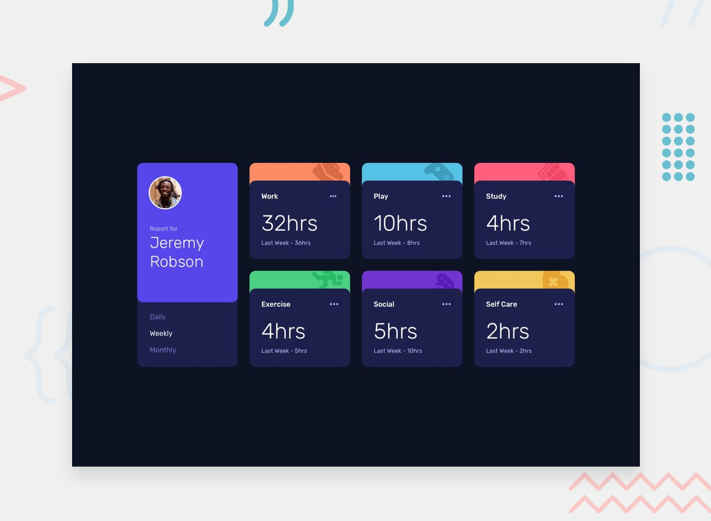

# Frontend Mentor - Time tracking dashboard



## Welcome! 👋

# Time Tracking Dashboard

A responsive dashboard that displays time-tracking data with interactive daily, weekly, and monthly filters.

## Description

This project is a solution to the "Time Tracking Dashboard" challenge from Frontend Mentor. The main objective was to build a single-page dashboard that dynamically updates its content based on user interaction. This project is an excellent example of using **JavaScript** to fetch data (likely from a JSON file), manipulate the DOM, and create a dynamic UI that responds to user input without reloading the page.

## Technologies Used

* **HTML5:** For creating the semantic structure of the dashboard, including the profile card and the activity cards.
* **CSS3:** Used for all the styling, including the responsive grid layout, colors, typography, and visual design of the cards.
* **JavaScript:** The core technology that brings the dashboard to life. It handles:
    * Fetching and processing time-tracking data.
    * Listening for click events on the time filters (Daily, Weekly, Monthly).
    * Dynamically updating the current and previous time values on all activity cards.

## Installation

This is a static frontend project, so no complex setup is required. To get a local copy, simply follow these steps:

1.  Clone the repository:
    ```bash
    git clone [https://github.com/hangtime319/time-tracking-dashboard.git](https://github.com/hangtime319/time-tracking-dashboard.git)
    ```
2.  Open the `index.html` file in your preferred web browser to view the project.

## Usage

This project serves as a showcase of a professional and functional dashboard UI. The user can click on the filters in the profile card to instantly change the time period for each activity, demonstrating a seamless and interactive user experience.

## Features

* **Dynamic Data Display:** The dashboard updates its values in real-time based on the selected time frame.
* **Interactive Filters:** Users can easily switch between daily, weekly, and monthly data.
* **Responsive Dashboard UI:** The layout is optimized to look great on all screen sizes, from mobile phones to desktops.
* **Clean & Modern Design:** The visual style is professional and intuitive.

## Contribution

Contributions are welcome! If you'd like to improve this project, please follow these steps:

1.  Fork the repository.
2.  Create a new branch (`git checkout -b feature/your-feature-name`).
3.  Commit your changes (`git commit -m 'feat: Add a new feature'`).
4.  Push to your branch (`git push origin feature/your-feature-name`).
5.  Open a Pull Request.

## License

This project is licensed under the MIT License.
